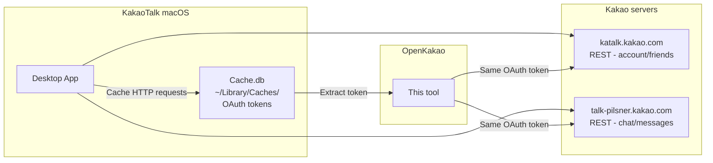

# OpenKakao

[](https://pypi.org/project/openkakao/)
[](https://www.python.org/downloads/)
[](https://github.com/JungHoonGhae/kakaotalk-cli/stargazers)
[](https://github.com/JungHoonGhae/kakaotalk-cli/blob/main/LICENSE)

[한국어](README.md) | **English**

| [](https://github.com/JungHoonGhae) | Follow [@JungHoonGhae](https://github.com/JungHoonGhae) on GitHub for more projects. |
| :-----| :----- |
| [](https://x.com/lucas_ghae) | Follow [@lucas_ghae](https://x.com/lucas_ghae) on X for updates. |

**OpenKakao** is an unofficial CLI client for the KakaoTalk macOS desktop app — access chat rooms, messages, and friends from your terminal.

> **Disclaimer**: This project is an independent technical-research CLI tool. It is not affiliated with, endorsed by, or certified by Kakao Corp. KakaoTalk is a trademark of Kakao Corp.

## About

As of 2026, Discord, Slack, and Telegram all provide official APIs so developers can build bots, automation, and AI assistants. KakaoTalk is the de facto messenger for ~47 million users in Korea, but there is no official developer API for personal chat access.

This project is a technical proof-of-concept exploring **“What would be possible if KakaoTalk had an official API?”** It extracts auth tokens from the macOS KakaoTalk app’s HTTP cache and accesses chat data from the terminal via REST APIs.

**What it does:**
- List chat rooms (1:1, group, open chat, memo)
- Read messages (with pagination)
- List and search friends
- View profile and account settings
- List chat room members

> **Note**: Sending messages is not supported. This tool is read-only.

## Support

If this project helps you, consider supporting the author:

<a href="https://www.buymeacoffee.com/lucas.ghae">
  
</a>

## Features

- 💬 **Chats** — List all chat rooms, filter by unread
- 📖 **Messages** — Read chat messages with pagination
- 👥 **Friends** — Full list, favorites, search by name
- 👤 **Profile** — Your profile, member info
- 🔗 **Link preview** — URL scraping (OG tags)
- 🔐 **Auto auth** — Extract tokens from the KakaoTalk macOS app

## Requirements

| Requirement | Version / Notes |
|-------------|-----------------|
| Python | >= 3.11 |
| macOS | KakaoTalk desktop app installed |
| KakaoTalk macOS | Logged in |

## Installation

```bash
git clone https://github.com/JungHoonGhae/kakaotalk-cli.git
cd kakaotalk-cli
pip install -e .
```

## Rust CLI (Preview)

During staged migration, the Rust build is distributed as `openkakao-rs`.

```bash
# Homebrew (separate tap)
brew tap JungHoonGhae/openkakao
brew install openkakao-rs

# Example
openkakao-rs login --save
openkakao-rs chats
```

## Rust Release Guide

For Rust release and Homebrew automation, see:

- [docs/RELEASING_RUST.md](docs/RELEASING_RUST.md)

Key points:
- Release tag format: `openkakao-rs-vX.Y.Z`
- GitHub Actions secret: `HOMEBREW_TAP_TOKEN` (token with push access to tap repo)

## Quick Start

```bash
# 1. Authenticate (KakaoTalk app must be running)
openkakao login --save

# 2. List chat rooms
openkakao chats

# 3. Read messages
openkakao read <chat_id>
```

## Usage

### Chats

```bash
# Chat list (last 30)
openkakao chats

# All chats
openkakao chats --all

# Unread only
openkakao chats --unread

# Read messages
openkakao read 382367313744175

# Last 10 only
openkakao read 382367313744175 -n 10

# Older messages
openkakao read 382367313744175 --before <log_id>

# Chat members
openkakao members 382367313744175
```

### Friends

```bash
# All friends
openkakao friends

# Favorites only
openkakao friends -f

# Search by name
openkakao friends -s "John"
```

### Profile / Settings

```bash
# My profile
openkakao me

# Account settings
openkakao settings

# Check token status
openkakao auth
```

### Utilities

```bash
# Link preview
openkakao scrap https://github.com
```

## How It Works



1. The macOS KakaoTalk app caches HTTP request headers in `NSURLCache` (SQLite).
2. OpenKakao extracts the OAuth token from that cache.
3. It calls Kakao’s REST APIs with the same token.
4. Same endpoints and headers as the official app.

## Limitations

- **Read-only** — Sending messages would require the LOCO binary protocol (not implemented).
- **macOS only** — Token extraction depends on macOS NSURLCache.
- **Token lifetime** — The app refreshes tokens periodically; they can expire.
- **Unofficial** — May break at any time if Kakao changes their servers.

## TODO

### ✅ Done

| Item | Notes |
|------|-------|
| OAuth token extraction from NSURLCache | `openkakao login --save` |
| katalk.kakao.com REST | Account, friends, settings — `openkakao me`, `friends`, `settings` |
| talk-pilsner.kakao.com REST | Chat list, messages, members, link preview — `openkakao chats`, `read`, `members`, `scrap` |
| LOCO Booking & Checkin | GETCONF, CHECKIN (RSA+AES, key_encrypt_type=16) |
| LOCO packet codec | 22B header + BSON, `openkakao.packet` / `crypto` |

### 📋 TODO

| Priority | Item | Next steps |
|----------|------|------------|
| High | LOCO LOGINLIST -950 (token expired) | Capture `renew_token.json` POST body with mitmproxy; or use Frida to inspect token used by app |
| High | `renew_token.json` parameter spec | mitmproxy capture |
| Medium | Send messages (LOCO WRITE) | Implement after LOCO login works |
| Medium | UserDefaults decryption | Frida runtime hooking |
| Low | login.json X-VC header | Binary analysis / Frida |
| Low | __hhaa__ response decryption | Binary analysis (chat/messages covered by Pilsner REST) |

See [docs/TECHNICAL_REFERENCE.md](docs/TECHNICAL_REFERENCE.md) for technical details.

## Disclaimer

> **This software is provided for educational and technical research only.**
>
> - It is not affiliated with Kakao Corp. and is not endorsed or certified by Kakao.
> - It uses unofficial APIs and may violate KakaoTalk’s terms of service.
> - You are solely responsible for any account restrictions, suspensions, data loss, or other consequences of using this tool.
> - The authors disclaim all liability for direct, indirect, incidental, special, consequential, or punitive damages arising from use of this software.
> - Unauthorized access to others’ accounts or conversations may be illegal. Use only with your own account.
>
> **This software is provided “AS IS” without warranty of any kind.**

## References & Related Projects

OpenKakao was developed with reference to the following projects and research. We thank the authors and respect their copyright and licenses.

### References

| Project | Author(s) | What we used |
|---------|-----------|--------------|
| [node-kakao](https://github.com/storycraft/node-kakao) | [storycraft](https://github.com/storycraft) | TypeScript LOCO implementation — packet layout, BSON fields, server flow |
| [KiwiTalk](https://github.com/KiwiTalk/KiwiTalk) | [KiwiTalk](https://github.com/KiwiTalk) | Rust+TypeScript cross-platform client — LOCO/REST architecture |
| [kakao.py](https://github.com/jhleekr/kakao.py) | [jhleekr](https://github.com/jhleekr) | Python LOCO/HTTP wrapper — Python-side implementation |
| [kakaotalk_analysis](https://github.com/stulle123/kakaotalk_analysis) | [stulle123](https://github.com/stulle123) | KakaoTalk security/protocol analysis — token and crypto research |

## Contributing

Contributions are welcome. See [CONTRIBUTING.md](CONTRIBUTING.md).

## Changelog

See [CHANGELOG.md](CHANGELOG.md).

## License

MIT — see [LICENSE](LICENSE).
