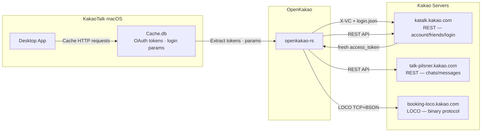

# OpenKakao

[](https://github.com/JungHoonGhae/openkakao/stargazers)
[](https://github.com/JungHoonGhae/openkakao/blob/main/LICENSE)
[](https://www.rust-lang.org/)

[한국어](README.md) | **English**

Unofficial KakaoTalk CLI client for macOS. Access chat rooms, messages, and friends, and send/receive messages via the LOCO binary protocol.

> **Disclaimer**: This is a technical research CLI tool. It is not affiliated with or endorsed by Kakao Corp.

<p align="center">
  
</p>

## Background

KakaoTalk offers business APIs (Channel API, Kakao Login, etc.), but **there is no official API for accessing personal chats.** Unlike Discord Bot API, Slack Webhooks, or Telegram Bot Framework, there is no way to programmatically read or send messages in your own chat rooms.

OpenKakao reverse-engineered the authentication algorithm (X-VC) via static analysis of the macOS KakaoTalk binary, and implemented the internal binary protocol (LOCO) in Rust.

- Read and send personal chat messages
- Query chat rooms, friends, and profiles
- Compose with Unix tools like `jq`, `cron`, `LLM`

## Features

- 💬 **Chats** — List all chat rooms, filter unread, search
- 📖 **Messages** — Read messages, fetch all (`--all`), search, export (JSON/CSV/TXT)
- 👥 **Friends** — Full list, favorites, search, add/remove favorites, hide/unhide
- 👤 **Profile** — My profile, friend profiles, multi-profiles, account settings
- 🔗 **Link preview** — URL scraping (OG tags)
- 🔐 **Auto auth** — Token extraction from macOS KakaoTalk app + X-VC login
- 🔌 **LOCO protocol** — Binary protocol (TCP+BSON) connection (Booking → Checkin → Login)
- 📤 **JSON output** — `--json` flag on all commands, pipe to `jq`
- 🐚 **Shell completions** — bash/zsh/fish

## Requirements

| Requirement | Version/Notes |
|-------------|---------------|
| macOS | KakaoTalk desktop app installed and logged in |
| Rust | >= 1.75 (for building from source) |

## Installation

```bash
# Homebrew
brew tap JungHoonGhae/openkakao
brew install openkakao-rs

# Or build from source
git clone https://github.com/JungHoonGhae/openkakao.git
cd openkakao/openkakao-rs
cargo install --path .
```

## Agent Skill

The OpenKakao agent skill is available in `JungHoonGhae/skills`.

```bash
npx skills add JungHoonGhae/skills@openkakao-cli
```

## Quick Start

```bash
# 1. Authenticate (KakaoTalk app must be running)
openkakao-rs login --save

# 2. List chat rooms
openkakao-rs chats

# 3. Read messages
openkakao-rs read <chat_id>

# 4. Test LOCO protocol connection
openkakao-rs loco-test
```

## Usage

### Authentication

```bash
# Extract and save token
openkakao-rs login --save

# Check token validity
openkakao-rs auth

# Refresh token via login.json (auto X-VC generation)
openkakao-rs relogin --fresh-xvc

# Renew token (via refresh_token)
openkakao-rs renew
```

### Chats

```bash
# Chat rooms (latest 30)
openkakao-rs chats

# All chat rooms
openkakao-rs chats --all

# Unread only
openkakao-rs unread

# Search chat rooms
openkakao-rs chats --search "project"

# Filter by type (dm, group, memo, open)
openkakao-rs chats --type dm

# Read messages (latest 30)
openkakao-rs read <chat_id>

# Latest 10 only
openkakao-rs read <chat_id> -n 10

# Fetch all messages (cursor pagination)
openkakao-rs read <chat_id> --all

# Chat room members
openkakao-rs members <chat_id>

# Search messages
openkakao-rs search <chat_id> "keyword"

# Export messages
openkakao-rs export <chat_id> --format json
openkakao-rs export <chat_id> --format csv -o messages.csv
openkakao-rs export <chat_id> --format txt
```

### Friends

```bash
# All friends
openkakao-rs friends

# Favorites only
openkakao-rs friends -f

# Search by name
openkakao-rs friends -s "John"

# Friend profile
openkakao-rs profile <user_id>

# Add/remove favorites
openkakao-rs favorite <user_id>
openkakao-rs unfavorite <user_id>

# Hide/unhide friends
openkakao-rs hide <user_id>
openkakao-rs unhide <user_id>
```

### Profile / Settings

```bash
# My profile
openkakao-rs me

# Multi-profile list
openkakao-rs profiles

# Account settings
openkakao-rs settings

# Notification keywords
openkakao-rs keywords

# JSON output (available on all commands)
openkakao-rs me --json
openkakao-rs friends --json | jq '.[]'
```

### LOCO Protocol

```bash
# Test LOCO connection (booking → checkin → login)
openkakao-rs loco-test

# Send a message
openkakao-rs send <chat_id> "message content"

# Watch real-time incoming messages
openkakao-rs watch
openkakao-rs watch --chat-id <chat_id>

# Read chat history (SYNCMSG)
openkakao-rs loco-read <chat_id>
openkakao-rs loco-read <chat_id> --all

# List chat rooms (LOCO)
openkakao-rs loco-chats
```

### Utilities

```bash
# Link preview
openkakao-rs scrap https://github.com

# Shell completions
openkakao-rs completions zsh >> ~/.zfunc/_openkakao-rs
openkakao-rs completions fish > ~/.config/fish/completions/openkakao-rs.fish

# Watch Cache.db for token changes
openkakao-rs watch-cache --interval 10
```

## How It Works


```mermaid
flowchart LR
    subgraph app["KakaoTalk macOS"]
        A[Desktop App]
        C[Cache.db<br/>OAuth tokens · login params]
    end
    subgraph servers["Kakao Servers"]
        K[katalk.kakao.com<br/>REST — account/friends/login]
        P[talk-pilsner.kakao.com<br/>REST — chats/messages]
        L[booking-loco.kakao.com<br/>LOCO — binary protocol]
    end
    subgraph tool["OpenKakao"]
        O[openkakao-rs]
    end

    A -->|Cache HTTP requests| C
    C -->|Extract tokens · params| O
    O -->|X-VC + login.json| K
    K -->|fresh access_token| O
    O -->|REST API| K
    O -->|REST API| P
    O -->|LOCO TCP+BSON| L
```

### Auth Flow

1. Extract login parameters from macOS KakaoTalk's Cache.db
2. Generate X-VC header (auth algorithm found via binary static analysis)
3. POST to `login.json` for a fresh access_token
4. Call REST APIs or connect via LOCO protocol

### LOCO Protocol

KakaoTalk's binary TCP protocol. 22-byte little-endian header + BSON body.

| Step | Server | Method | Purpose |
|------|--------|--------|---------|
| Booking | `booking-loco.kakao.com:443` | TLS | Server configuration |
| Checkin | `ticket-loco.kakao.com:995` | RSA+AES | Chat server assignment |
| Login | LOCO server | RSA+AES | Auth + chat list |

## Use Cases

With message send/receive working, various automations are possible.

| Category | Examples |
|----------|----------|
| **Automation** | Daily unread summary via `cron`, keyword-triggered alerts |
| **AI integration** | Feed conversation context to LLM for auto-reply, summarization, translation |
| **Data pipeline** | Store messages in SQLite/PostgreSQL, auto-archive shared links |
| **Monitoring** | Open chat keyword monitoring, conversation volume stats |
| **Personal tools** | Unread chat dashboard, date/user search, conversation export |

```bash
# Send daily unread summary to yourself
openkakao-rs unread --json | jq -r '.[] | "\(.title): \(.unread_count) unread"' | \
  xargs -I{} openkakao-rs send <memo_chat_id> "{}"

# Summarize recent messages with LLM
openkakao-rs read <chat_id> --all --json | llm "Summarize this conversation in 3 lines"
```

> Uses unofficial APIs — recommended for personal research/automation only.

## Limitations

- **macOS only** — Token extraction depends on macOS NSURLCache
- **Unofficial** — May break if Kakao updates their servers
- **REST cache limit** — Pilsner REST API only returns messages from recently opened chats (LOCO bypasses this)

## TODO

### Done

| Item | Notes |
|------|-------|
| OAuth token extraction from NSURLCache | `login --save` |
| X-VC auth algorithm reverse engineering | `relogin --fresh-xvc` |
| katalk.kakao.com REST | Account/friends/settings/profile/favorites/hide |
| talk-pilsner.kakao.com REST | Chat list, messages read/search/export, members |
| LOCO protocol (Booking → Checkin → Login) | `loco-test` — 27 chat rooms received |
| LOCO message send (WRITE) | `send <chat_id> "message"` — verified |
| LOCO real-time receive (watch) | `watch [--chat-id ID]` — real-time messages |
| LOCO message read (SYNCMSG) | `loco-read <chat_id> --all` — server-retained history |
| Auto token refresh | `relogin --fresh-xvc` — fresh token via login.json + X-VC |
| LOCO packet codec + encryption | 22B header + BSON, RSA-2048 OAEP + AES-128-CFB |
| JSON output | `--json` global flag |
| Shell completions | bash/zsh/fish |
| Color output | `--no-color` flag |

### Planned

| Priority | Item | Notes |
|----------|------|-------|
| Medium | TUI mode | `ratatui`-based terminal UI |
| Medium | Media attachment parsing | attachment JSON parsing + download |
| Low | Webhook/Hook system | Shell script/webhook on message receive |
| Low | macOS notifications | Native notifications in `watch` mode |

## Disclaimer

> This software is provided for technical research purposes "AS IS" without warranty. It may violate KakaoTalk's terms of service. All consequences of use are the user's responsibility. Use only with your own account.

## References

| Project | Reference |
|---------|-----------|
| [node-kakao](https://github.com/storycraft/node-kakao) | LOCO protocol implementation (packet structure, BSON fields) |
| [KiwiTalk](https://github.com/KiwiTalk/KiwiTalk) | Rust LOCO/REST architecture |
| [kakao.py](https://github.com/jhleekr/kakao.py) | Python LOCO/HTTP implementation |
| [kakaotalk_analysis](https://github.com/stulle123/kakaotalk_analysis) | Security/protocol analysis |

## Contributing

Contributions welcome! See [CONTRIBUTING.md](CONTRIBUTING.md).

## Changelog

See [CHANGELOG.md](CHANGELOG.md).

## License

MIT — see [LICENSE](LICENSE).
