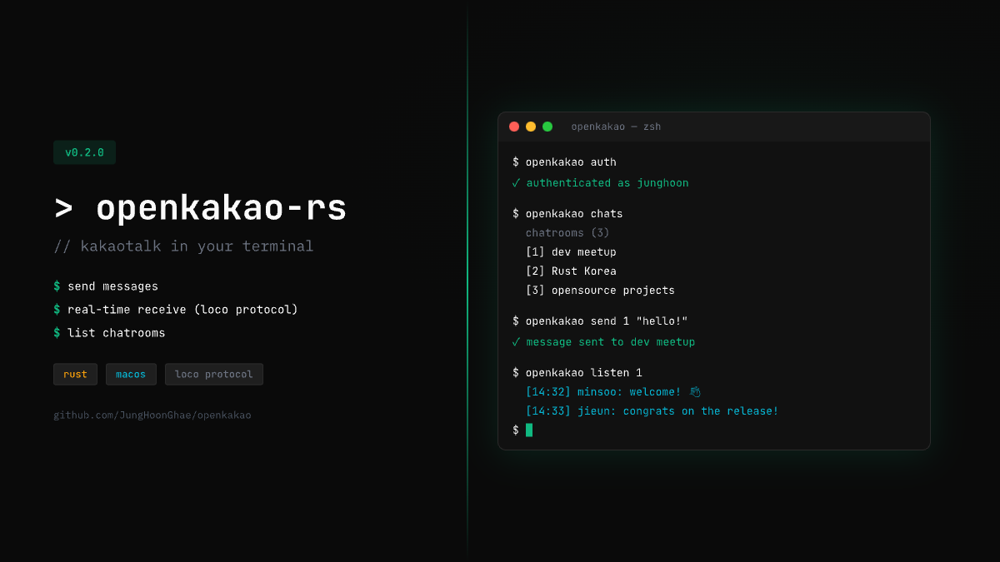

<div align="center">
  <h1>OpenKakao</h1>
  <p>Unofficial CLI for KakaoTalk on macOS.</p>
  <p>It works well as a terminal tool for humans and as a local interface for AI or agent workflows through JSON output, watch mode, hooks, and webhooks.</p>
  <p>The executable name is <code>openkakao-rs</code>.</p>
</div>

<p align="center">
  <a href="#quick-start"><strong>Quick Start</strong></a> ·
  <a href="#highlights"><strong>Highlights</strong></a> ·
  <a href="#docs"><strong>Docs</strong></a> ·
  <a href="#claude-code-skill"><strong>Claude Code Skill</strong></a>
</p>

<p align="center">
  <a href="https://github.com/JungHoonGhae/openkakao/stargazers"></a>
  <a href="LICENSE"></a>
  <a href="https://www.rust-lang.org/"></a>
  <a href="https://openkakao.vercel.app/"></a>
  <a href="https://openkakao.vercel.app/"></a>
</p>

[한국어](README.md) | **English**

> [!WARNING]
> This project is an unofficial CLI and is not affiliated with or endorsed by Kakao Corp. It is built for research, automation, and local workflows around the macOS KakaoTalk app.

<div align="center">
<table>
  <tr>
    <td align="center"><strong>Works with</strong></td>
    <td align="center"><br /><sub>OpenClaw</sub></td>
    <td align="center"><br /><sub>Claude Code</sub></td>
    <td align="center"><br /><sub>Codex</sub></td>
    <td align="center"><br /><sub>Cursor</sub></td>
    <td align="center"><br /><sub>Bash</sub></td>
    <td align="center"><br /><sub>HTTP</sub></td>
  </tr>
</table>
</div>

<p align="center">
  
</p>

## Quick Start

### For Human

```bash
# Homebrew
brew tap JungHoonGhae/openkakao
brew install openkakao-rs

# 1. Save auth data
openkakao-rs login --save

# 2. List chats
openkakao-rs chats

# 3. Read messages
openkakao-rs read <chat_id> -n 20

# 4. Send a message
openkakao-rs send <chat_id> "Hello from CLI!"
```

Only force the older cache-backed path when you need it:

```bash
openkakao-rs chats --rest
openkakao-rs read <chat_id> --rest
openkakao-rs members <chat_id> --rest
```

### For Agent

```bash
# Structured output
openkakao-rs --json chats
openkakao-rs --json read <chat_id> -n 20

# Real-time event stream
openkakao-rs watch --json

# Connect to local hooks or webhooks
openkakao-rs --unattended --allow-watch-side-effects watch \
  --hook-cmd 'jq . > /tmp/openkakao-event.json'
```

To use it directly from Claude Code:

```bash
npx skills add JungHoonGhae/skills@openkakao-cli
```

## Highlights

- Extracts auth data from the macOS KakaoTalk app
- Reads chats, messages, members, friends, and profiles
- Sends messages, watches real-time events, and handles media over LOCO
- Fits well into `jq`, `cron`, SQLite, and LLM workflows through `--json`
- Connects to local automation and agent flows through `watch`, hooks, and webhooks
- Can recover some reads with `friends --local`, `profile --local`, and `profile --chat-id`

## Where It Fits

- when you want chat history as JSON for downstream tools
- when KakaoTalk should become an input channel for local scripts or operator tools
- when you want to trigger follow-up actions from watch events through hooks or webhooks
- when you want one CLI that works for both direct terminal use and AI-driven local workflows

## Requirements

| Requirement | Notes |
|-------------|-------|
| macOS | KakaoTalk desktop app must be installed and logged in |
| Rust >= 1.75 | Only for source builds |

## Installation

### Homebrew

```bash
brew tap JungHoonGhae/openkakao
brew install openkakao-rs
```

### From source

```bash
git clone https://github.com/JungHoonGhae/openkakao.git
cd openkakao/openkakao-rs
cargo install --path .
```

## Docs

- Documentation site: https://openkakao.vercel.app/
- Quick start: https://openkakao.vercel.app/docs/getting-started/quickstart/
- CLI reference: https://openkakao.vercel.app/docs/cli/overview/
- Automation overview: https://openkakao.vercel.app/docs/automation/overview/
- LLM / agent workflows: https://openkakao.vercel.app/docs/automation/llm-agent-workflows/
- Watch patterns: https://openkakao.vercel.app/docs/automation/watch-patterns/
- Protocol docs: https://openkakao.vercel.app/docs/protocol/overview/

Reverse engineering / local app-state diff:

```bash
openkakao-rs profile-hints --local-graph --json
openkakao-rs profile-hints --app-state --json > /tmp/profile-before.json
openkakao-rs profile-hints --app-state --app-state-diff /tmp/profile-before.json --json
```

## Claude Code Skill

```bash
npx skills add JungHoonGhae/skills@openkakao-cli
```

## Development

```bash
cd openkakao-rs
cargo build --release
```

Detailed usage, operational notes, and protocol details live in the docs site.

## Support

If this tool helps you, consider supporting its maintenance:

<a href="https://www.buymeacoffee.com/lucas.ghae">
  
</a>

## Contributing

Bug reports and PRs are welcome.

## License

MIT
