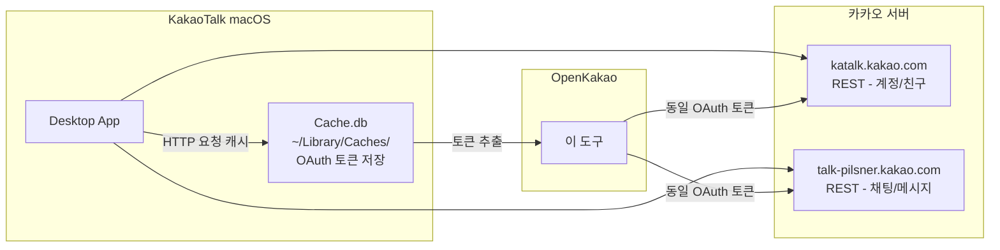

# OpenKakao

[](https://pypi.org/project/openkakao/)
[](https://www.python.org/downloads/)
[](https://github.com/JungHoonGhae/kakaotalk-cli/stargazers)
[](https://github.com/JungHoonGhae/kakaotalk-cli/blob/main/LICENSE)

**한국어** | [English](README.en.md)

카카오톡 macOS 데스크탑 앱의 비공식 CLI 클라이언트 **OpenKakao** — 터미널에서 채팅방, 메시지, 친구 목록에 접근합니다.

> **Disclaimer**: 이 프로젝트는 독립적인 기술 연구용 CLI 도구입니다. 카카오(Kakao Corp.)와 아무런 관련이 없으며, 카카오의 승인이나 보증을 받지 않았습니다. KakaoTalk은 Kakao Corp.의 상표입니다.

## About

2026년 현재, Discord, Slack, Telegram은 모두 공식 API를 제공하여 개발자가 봇, 자동화, AI 어시스턴트를 만들 수 있습니다. 카카오톡은 한국에서 4,700만 명이 사용하는 사실상 유일한 메신저이지만, 개인 채팅에 접근할 수 있는 공식 개발자 API는 존재하지 않습니다.

이 프로젝트는 **"카카오톡에 공식 API가 있었다면 어떤 것들이 가능했을까?"** 를 탐구하기 위한 기술적 실험(proof of concept)입니다. macOS 카카오톡 앱의 HTTP 캐시에서 인증 토큰을 추출하고, REST API를 통해 터미널에서 채팅 데이터에 접근합니다.

**What it does:**
- 채팅방 목록 조회 (1:1, 단톡, 오픈채팅, 메모)
- 메시지 읽기 (페이징 지원)
- 친구 목록 조회 및 검색
- 프로필/계정 정보 조회
- 채팅방 멤버 목록

> **Note**: 메시지 전송은 지원하지 않습니다. 이 도구는 읽기 전용(read-only)입니다.

## Features

- 💬 **채팅방** — 전체 채팅방 목록, 안 읽은 메시지 필터링
- 📖 **메시지** — 채팅 메시지 읽기, 이전 메시지 페이징
- 👥 **친구** — 전체 목록, 즐겨찾기, 이름 검색
- 👤 **프로필** — 내 프로필, 멤버 정보
- 🔗 **링크 프리뷰** — URL 스크래핑 (OG 태그)
- 🔐 **자동 인증** — macOS 카카오톡 앱에서 토큰 자동 추출

## 이 CLI로 만들 수 있는 것들

조회·분석·자동 리포팅 중심으로 아래 같은 도구를 만들 수 있습니다.

- 개인 채팅/안읽음 대시보드
- 키워드 기반 아침 브리핑 봇
- 기간/유저/키워드 검색 도구
- 오픈채팅 모니터링 리포터
- 공유 링크 아카이브 파이프라인
- 읽기 전용 AI 요약 도우미

잘 맞는 조합:
- `cron + openkakao-rs`
- `openkakao-rs + jq`
- `openkakao-rs + sqlite/postgres`
- `openkakao-rs + LLM`

> 주의: 현재는 읽기 전용이며 비공식 API 기반이므로, 계정 안전/약관 리스크를 감안해 개인 연구/자동화 용도로만 사용하는 것을 권장합니다.

## Requirements

| Requirement | Version/Notes |
|-------------|---------------|
| Python | >= 3.11 |
| macOS | 카카오톡 데스크탑 앱 설치 |
| KakaoTalk macOS | 로그인된 상태 |

## Installation

```bash
git clone https://github.com/JungHoonGhae/kakaotalk-cli.git
cd kakaotalk-cli
pip install -e .
```

## Rust CLI (Preview)

단계적 전환 중이며 Rust 버전은 `openkakao-rs` 바이너리로 배포된다.

```bash
# Homebrew (별도 tap)
brew tap JungHoonGhae/openkakao
brew install openkakao-rs

# 실행 예시
openkakao-rs login --save
openkakao-rs chats
```

## Quick Start

```bash
# 1. 인증 (카카오톡 앱이 실행 중이어야 함)
openkakao login --save

# 2. 채팅방 목록
openkakao chats

# 3. 메시지 읽기
openkakao read <chat_id>
```

## Usage

### 채팅

```bash
# 채팅방 목록 (최근 30개)
openkakao chats

# 전체 채팅방
openkakao chats --all

# 안 읽은 채팅만
openkakao chats --unread

# 메시지 읽기
openkakao read 382367313744175

# 최근 10개만
openkakao read 382367313744175 -n 10

# 이전 메시지 더 보기
openkakao read 382367313744175 --before <log_id>

# 채팅방 멤버
openkakao members 382367313744175
```

### 친구

```bash
# 전체 친구 목록
openkakao friends

# 즐겨찾기만
openkakao friends -f

# 이름으로 검색
openkakao friends -s "홍길동"
```

### 프로필/설정

```bash
# 내 프로필
openkakao me

# 계정 설정
openkakao settings

# 토큰 상태 확인
openkakao auth
```

### 유틸리티

```bash
# 링크 프리뷰
openkakao scrap https://github.com
```

## 작동 원리



1. macOS 카카오톡 앱이 HTTP 요청 헤더를 `NSURLCache`(SQLite)에 캐시
2. 캐시에서 OAuth 토큰을 자동 추출
3. 추출한 토큰으로 카카오톡 서버 REST API 호출
4. 카카오톡 앱과 동일한 엔드포인트/헤더 사용

## 한계

- **읽기 전용** — 메시지 전송은 LOCO 바이너리 프로토콜이 필요하며 현재 미지원
- **macOS 전용** — 토큰 추출이 macOS의 NSURLCache에 의존
- **토큰 수명** — 카카오톡 앱이 주기적으로 토큰 갱신, 오래되면 만료
- **비공식** — 카카오 서버 업데이트에 의해 언제든 동작 중단 가능

## TODO

### ✅ 해결된 것

| 항목 | 비고 |
|------|------|
| NSURLCache에서 OAuth 토큰 추출 | `openkakao login --save` |
| katalk.kakao.com REST | 계정/친구/설정 — `openkakao me`, `friends`, `settings` |
| talk-pilsner.kakao.com REST | 채팅방 목록, 메시지 읽기, 멤버, 링크 프리뷰 — `openkakao chats`, `read`, `members`, `scrap` |
| LOCO Booking·Checkin | GETCONF, CHECKIN (RSA+AES, key_encrypt_type=16) |
| LOCO 패킷 코덱 | 22B 헤더 + BSON, `openkakao.packet` / `crypto` |

### 📋 할 일 (TODO)

| 우선순위 | 항목 | 해결 후보 |
|----------|------|-----------|
| 높음 | LOCO LOGINLIST -950 (토큰 만료) | mitmproxy로 `renew_token.json` POST body 캡처, Frida로 앱이 사용하는 토큰 확인 |
| 높음 | `renew_token.json` 파라미터 규격 | mitmproxy 캡처 |
| 중간 | 메시지 전송 (LOCO WRITE) | LOCO 로그인 성공 후 구현 |
| 중간 | UserDefaults 복호화 | Frida 런타임 후킹 |
| 낮음 | login.json X-VC 헤더 | 바이너리 분석 / Frida |
| 낮음 | __hhaa__ 응답 복호화 | 바이너리 분석 (채팅/메시지는 Pilsner REST로 대체 가능) |

상세 기술 내용은 [docs/TECHNICAL_REFERENCE.md](docs/TECHNICAL_REFERENCE.md) 참고.

## 면책 조항

> **이 소프트웨어는 교육 및 기술 연구 목적으로만 제작되었습니다.**
>
> - 카카오(Kakao Corp.)와 무관하며, 카카오의 승인이나 보증을 받지 않았습니다.
> - 비공식 API를 사용하며, 카카오톡 서비스 이용약관에 위배될 수 있습니다.
> - 이 도구의 사용으로 인한 계정 제한, 정지, 데이터 손실 등 모든 결과에 대한 책임은 전적으로 사용자에게 있습니다.
> - 개발자는 이 소프트웨어 사용으로 인한 직접적, 간접적, 부수적, 특별, 결과적 또는 징벌적 손해에 대해 어떠한 책임도 지지 않습니다.
> - 타인의 계정이나 대화에 무단으로 접근하는 것은 법적으로 금지됩니다. 반드시 본인의 계정으로만 사용하십시오.
>
> **이 소프트웨어는 "있는 그대로(AS IS)" 제공되며, 어떠한 종류의 보증도 포함하지 않습니다.**

## 참조·관련 프로젝트

OpenKakao는 카카오톡 비공식 API·프로토콜 연구를 위해 아래 프로젝트와 문서를 참고하였다. 각 프로젝트에 감사하며, 저작자와 라이선스를 존중한다.

### 참조한 프로젝트 (References)

| 프로젝트 | 저작자/팀 | 참고 내용 |
|----------|-----------|-----------|
| [node-kakao](https://github.com/storycraft/node-kakao) | [storycraft](https://github.com/storycraft) | TypeScript LOCO 프로토콜 구현 — 패킷 구조, BSON 필드, 서버 플로우 참고 |
| [KiwiTalk](https://github.com/KiwiTalk/KiwiTalk) | [KiwiTalk](https://github.com/KiwiTalk) | Rust+TypeScript 크로스플랫폼 클라이언트 — LOCO·REST 아키텍처 참고 |
| [kakao.py](https://github.com/jhleekr/kakao.py) | [jhleekr](https://github.com/jhleekr) | Python LOCO/HTTP 래퍼 — Python 측 구현 참고 |
| [kakaotalk_analysis](https://github.com/stulle123/kakaotalk_analysis) | [stulle123](https://github.com/stulle123) | 카카오톡 보안·프로토콜 분석 — 토큰·암호화 관련 연구 참고 |

## Contributing

기여를 환영합니다! [CONTRIBUTING.md](CONTRIBUTING.md)를 참고해주세요.

## Changelog

변경 이력은 [CHANGELOG.md](CHANGELOG.md)를 참고해주세요.

## License

MIT — [LICENSE](LICENSE) 참조.
