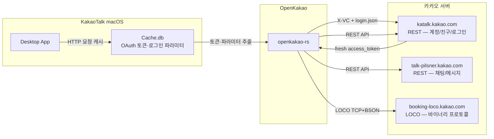

# OpenKakao

[](https://github.com/JungHoonGhae/openkakao/stargazers)
[](https://github.com/JungHoonGhae/openkakao/blob/main/LICENSE)
[](https://www.rust-lang.org/)

**한국어** | [English](README.en.md)

카카오톡 macOS 데스크탑 앱의 비공식 CLI 클라이언트 — 터미널에서 채팅방, 메시지, 친구 목록에 접근하고, LOCO 바이너리 프로토콜로 실시간 연결합니다.

> **Disclaimer**: 이 프로젝트는 독립적인 기술 연구용 CLI 도구입니다. 카카오(Kakao Corp.)와 아무런 관련이 없으며, 카카오의 승인이나 보증을 받지 않았습니다. KakaoTalk은 Kakao Corp.의 상표입니다.

## Why This Matters

**한국의 모든 대화는 카카오톡 위에서 일어난다.** 4,700만 명 — 전 국민의 93%가 매일 사용하는 사실상 유일한 메신저. 가족, 친구, 직장, 거래, 민원까지 전부 카카오톡이다.

그런데 이 플랫폼에는 **개발자 API가 없다.**

Discord에는 Bot API가 있고, Slack에는 Webhook이 있고, Telegram에는 Bot Framework가 있다. 카카오톡에는 없다. 내 대화, 내 데이터인데 프로그래밍으로 접근할 방법이 원천적으로 차단되어 있다.

**OpenKakao는 이 벽을 뚫었다.**

macOS 카카오톡 바이너리를 `otool`로 디스어셈블하여 인증 알고리즘(X-VC)을 역공학하고, 카카오톡의 내부 바이너리 프로토콜(LOCO)을 Rust로 구현했다. 결과:

- **터미널에서 카카오톡 메시지를 읽고, 보낸다** — 실제 검증 완료
- **채팅방, 친구, 프로필을 프로그래밍으로 조회한다** — REST + LOCO 양쪽 경로
- **`jq`, `cron`, `sqlite`, `LLM`과 조합할 수 있다** — Unix 철학 그대로

이것은 단순한 CLI 도구가 아니라, **카카오톡 생태계에 개발자 접근성을 만드는 시도**다. 공식 API가 제공되지 않는 환경에서, 역공학과 프로토콜 분석만으로 그 간극을 메운 오픈소스 proof of concept이다.

## Features

- 💬 **채팅방** — 전체 채팅방 목록, 안 읽은 메시지 필터링, 검색
- 📖 **메시지** — 채팅 메시지 읽기, 전체 조회(`--all`), 검색, 내보내기(JSON/CSV/TXT)
- 👥 **친구** — 전체 목록, 즐겨찾기, 이름 검색, 즐겨찾기 추가/제거, 숨김/해제
- 👤 **프로필** — 내 프로필, 친구 프로필, 멀티 프로필, 계정 설정
- 🔗 **링크 프리뷰** — URL 스크래핑 (OG 태그)
- 🔐 **자동 인증** — macOS 카카오톡 앱에서 토큰 자동 추출 + X-VC 기반 로그인
- 🔌 **LOCO 프로토콜** — 카카오톡 바이너리 프로토콜(TCP+BSON) 연결 (Booking → Checkin → Login)
- 📤 **JSON 출력** — 모든 커맨드에 `--json` 플래그 지원, `jq`와 조합 가능
- 🐚 **Shell completions** — bash/zsh/fish 자동완성

## Requirements

| Requirement | Version/Notes |
|-------------|---------------|
| macOS | 카카오톡 데스크탑 앱 설치 및 로그인 |
| Rust | >= 1.75 (소스 빌드 시) |

## Installation

```bash
# Homebrew
brew tap JungHoonGhae/openkakao
brew install openkakao-rs

# 또는 소스에서 빌드
git clone https://github.com/JungHoonGhae/openkakao.git
cd openkakao/openkakao-rs
cargo install --path .
```

## Agent Skill

OpenKakao 전용 에이전트 스킬은 `JungHoonGhae/skills`에 포함되어 있습니다.

```bash
npx skills add JungHoonGhae/skills@openkakao-cli
```

## Quick Start

```bash
# 1. 인증 (카카오톡 앱이 실행 중이어야 함)
openkakao-rs login --save

# 2. 채팅방 목록
openkakao-rs chats

# 3. 메시지 읽기
openkakao-rs read <chat_id>

# 4. LOCO 프로토콜 연결 테스트
openkakao-rs loco-test
```

## Usage

### 인증

```bash
# 토큰 추출 + 저장
openkakao-rs login --save

# 토큰 유효성 확인
openkakao-rs auth

# login.json으로 토큰 재발급 (X-VC 자동 생성)
openkakao-rs relogin --fresh-xvc

# 토큰 갱신 (refresh_token 사용)
openkakao-rs renew
```

### 채팅

```bash
# 채팅방 목록 (최근 30개)
openkakao-rs chats

# 전체 채팅방
openkakao-rs chats --all

# 안 읽은 채팅만
openkakao-rs unread

# 채팅방 검색
openkakao-rs chats --search "프로젝트"

# 타입별 필터 (dm, group, memo, open)
openkakao-rs chats --type dm

# 메시지 읽기 (최근 30개)
openkakao-rs read <chat_id>

# 최근 10개만
openkakao-rs read <chat_id> -n 10

# 전체 메시지 조회 (cursor 페이지네이션)
openkakao-rs read <chat_id> --all

# 채팅방 멤버
openkakao-rs members <chat_id>

# 메시지 검색
openkakao-rs search <chat_id> "키워드"

# 메시지 내보내기
openkakao-rs export <chat_id> --format json
openkakao-rs export <chat_id> --format csv -o messages.csv
openkakao-rs export <chat_id> --format txt
```

### 친구

```bash
# 전체 친구 목록
openkakao-rs friends

# 즐겨찾기만
openkakao-rs friends -f

# 이름으로 검색
openkakao-rs friends -s "홍길동"

# 친구 프로필 조회
openkakao-rs profile <user_id>

# 즐겨찾기 추가/제거
openkakao-rs favorite <user_id>
openkakao-rs unfavorite <user_id>

# 친구 숨김/해제
openkakao-rs hide <user_id>
openkakao-rs unhide <user_id>
```

### 프로필/설정

```bash
# 내 프로필
openkakao-rs me

# 멀티 프로필 목록
openkakao-rs profiles

# 계정 설정
openkakao-rs settings

# 알림 키워드
openkakao-rs keywords

# JSON 출력 (모든 커맨드에 사용 가능)
openkakao-rs me --json
openkakao-rs friends --json | jq '.[]'
```

### LOCO 프로토콜

```bash
# LOCO 연결 테스트 (booking → checkin → login)
openkakao-rs loco-test

# 메시지 전송
openkakao-rs send <chat_id> "메시지 내용"

# 실시간 메시지 수신
openkakao-rs watch
openkakao-rs watch --chat-id <chat_id>

# 채팅 히스토리 읽기 (SYNCMSG)
openkakao-rs loco-read <chat_id>
openkakao-rs loco-read <chat_id> --all

# 채팅방 목록 (LOCO)
openkakao-rs loco-chats
```

### 유틸리티

```bash
# 링크 프리뷰
openkakao-rs scrap https://github.com

# Shell completions
openkakao-rs completions zsh >> ~/.zfunc/_openkakao-rs
openkakao-rs completions fish > ~/.config/fish/completions/openkakao-rs.fish

# Cache.db 토큰 감시
openkakao-rs watch-cache --interval 10
```

## 작동 원리


```mermaid
flowchart LR
    subgraph 앱["KakaoTalk macOS"]
        A[Desktop App]
        C[Cache.db<br/>OAuth 토큰·로그인 파라미터]
    end
    subgraph 서버["카카오 서버"]
        K[katalk.kakao.com<br/>REST — 계정/친구/로그인]
        P[talk-pilsner.kakao.com<br/>REST — 채팅/메시지]
        L[booking-loco.kakao.com<br/>LOCO — 바이너리 프로토콜]
    end
    subgraph 도구["OpenKakao"]
        O[openkakao-rs]
    end

    A -->|HTTP 요청 캐시| C
    C -->|토큰·파라미터 추출| O
    O -->|X-VC + login.json| K
    K -->|fresh access_token| O
    O -->|REST API| K
    O -->|REST API| P
    O -->|LOCO TCP+BSON| L
```

### 인증 흐름

1. macOS 카카오톡 앱의 `NSURLCache`(Cache.db)에서 로그인 파라미터(email, password hash, device UUID) 추출
2. **X-VC 헤더 생성** — 바이너리 정적 분석으로 역공학한 인증 알고리즘 적용
3. `login.json`에 X-VC 헤더와 함께 POST → **fresh access_token** 발급
4. REST API: 발급받은 토큰으로 `katalk.kakao.com`, `talk-pilsner.kakao.com` 호출
5. LOCO 프로토콜: Booking(TLS) → Checkin(RSA+AES) → Login(LOGINLIST) — 실시간 바이너리 연결

### X-VC 인증 알고리즘

KakaoTalk 바이너리의 `MaldiveAPIClient.setXvcHeader:loginId:uuid:` 메서드를 `otool` 디스어셈블리로 정적 분석하여 역공학:

```
SHA-512("YLLAS|{loginId}|{deviceUUID}|GRAEB|{userAgent}")[0:16]
```

바이너리에 개별 문자 CFString(`Y`,`L`,`L`,`A`,`S` / `G`,`R`,`A`,`E`,`B`)으로 저장되어 있어, 일반적인 문자열 탐색으로는 발견할 수 없었음.

### LOCO 프로토콜

카카오톡의 바이너리 TCP 프로토콜. 22바이트 리틀엔디안 헤더 + BSON 바디로 구성.

| 단계 | 서버 | 방식 | 역할 |
|------|------|------|------|
| Booking | `booking-loco.kakao.com:443` | TLS | 서버 구성 정보 조회 (GETCONF) |
| Checkin | `ticket-loco.kakao.com:995` | RSA-2048 + AES-128-CFB | 채팅 서버 IP 할당 (CHECKIN) |
| Login | `<loco_host>:<port>` | RSA-2048 + AES-128-CFB | 인증 + 채팅방 목록 수신 (LOGINLIST) |

## 이 CLI로 가능한 것들

LOCO 프로토콜로 메시지 전송까지 가능해지면서, 읽기뿐 아니라 양방향 자동화가 열렸다.

| 카테고리 | 예시 |
|----------|------|
| **자동화** | `cron`으로 매일 아침 안 읽은 메시지 요약 전송, 특정 키워드 감지 시 알림 |
| **AI 연동** | LLM에 대화 컨텍스트를 넘겨서 자동 응답, 요약, 번역 |
| **데이터 파이프라인** | 채팅 메시지를 SQLite/PostgreSQL에 적재, 공유 링크 자동 아카이빙 |
| **모니터링** | 오픈채팅방 키워드 모니터링, 대화량 통계, 감성 분석 |
| **개인 도구** | 안 읽은 채팅 대시보드, 기간/유저별 검색, 대화 내보내기 |

```bash
# 안 읽은 채팅 요약을 매일 아침 나에게 전송
openkakao-rs unread --json | jq -r '.[] | "\(.title): \(.unread_count)건"' | \
  xargs -I{} openkakao-rs send <memo_chat_id> "{}"

# 특정 채팅방의 최근 메시지를 LLM으로 요약
openkakao-rs read <chat_id> --all --json | llm "이 대화를 3줄로 요약해줘"
```

> **주의**: 비공식 API 기반이므로, 계정 안전/약관 리스크를 감안해 **개인 연구/자동화 용도로만** 사용하는 것을 권장합니다.

## 한계

- **메시지 서버 캐시** — pilsner REST 서버는 카카오톡 앱에서 최근에 열었던 채팅방의 메시지만 캐싱 (대부분의 채팅방은 빈 결과 반환)
- **macOS 전용** — 토큰 추출이 macOS의 NSURLCache에 의존
- **비공식** — 카카오 서버 업데이트에 의해 언제든 동작 중단 가능

## TODO

### ✅ 완료

| 항목 | 비고 |
|------|------|
| NSURLCache에서 OAuth 토큰 추출 | `login --save` |
| X-VC 인증 알고리즘 역공학 | `relogin --fresh-xvc` |
| katalk.kakao.com REST | 계정/친구/설정/프로필/즐겨찾기/숨김 |
| talk-pilsner.kakao.com REST | 채팅방 목록, 메시지 읽기/검색/내보내기, 멤버 |
| LOCO 프로토콜 (Booking → Checkin → Login) | `loco-test` — 27개 채팅방 수신 확인 |
| LOCO 메시지 전송 (WRITE) | `send <chat_id> "메시지"` — 실제 전송 검증 완료 |
| LOCO 실시간 수신 (watch) | `watch [--chat-id ID]` — 실시간 메시지 수신 |
| LOCO 메시지 읽기 (SYNCMSG) | `loco-read <chat_id> --all` — 서버 보관 히스토리 조회 |
| 토큰 자동 갱신 | `relogin --fresh-xvc` — login.json + X-VC로 fresh token 발급 |
| LOCO 패킷 코덱 + 암호화 | 22B 헤더 + BSON, RSA-2048 OAEP + AES-128-CFB |
| JSON 출력 | `--json` 글로벌 플래그 |
| Shell completions | bash/zsh/fish |
| 컬러 출력 | `--no-color` 플래그 |

### 📋 할 일

| 우선순위 | 항목 | 비고 |
|----------|------|------|
| 중간 | TUI 모드 | `ratatui` 기반 터미널 UI |
| 중간 | 미디어 첨부파일 파싱 | attachment JSON 파싱 + 다운로드 |
| 낮음 | Webhook/Hook 시스템 | 메시지 수신 시 쉘 스크립트/webhook |
| 낮음 | macOS 알림 연동 | `watch` 모드에서 네이티브 알림 |

## 면책 조항

> **이 소프트웨어는 교육 및 기술 연구 목적으로만 제작되었습니다.**
>
> - 카카오(Kakao Corp.)와 무관하며, 카카오의 승인이나 보증을 받지 않았습니다.
> - 비공식 API를 사용하며, 카카오톡 서비스 이용약관에 위배될 수 있습니다.
> - 이 도구의 사용으로 인한 계정 제한, 정지, 데이터 손실 등 모든 결과에 대한 책임은 전적으로 사용자에게 있습니다.
> - 개발자는 이 소프트웨어 사용으로 인한 직접적, 간접적, 부수적, 특별, 결과적 또는 징벌적 손해에 대해 어떠한 책임도 지지 않습니다.
> - 타인의 계정이나 대화에 무단으로 접근하는 것은 법적으로 금지됩니다. 반드시 본인의 계정으로만 사용하십시오.
>
> **이 소프트웨어는 "있는 그대로(AS IS)" 제공되며, 어떠한 종류의 보증도 포함하지 않습니다.**

## 참조·관련 프로젝트

OpenKakao는 카카오톡 비공식 API·프로토콜 연구를 위해 아래 프로젝트와 문서를 참고하였다. 각 프로젝트에 감사하며, 저작자와 라이선스를 존중한다.

| 프로젝트 | 저작자/팀 | 참고 내용 |
|----------|-----------|-----------|
| [node-kakao](https://github.com/storycraft/node-kakao) | [storycraft](https://github.com/storycraft) | TypeScript LOCO 프로토콜 구현 — 패킷 구조, BSON 필드, 서버 플로우 참고 |
| [KiwiTalk](https://github.com/KiwiTalk/KiwiTalk) | [KiwiTalk](https://github.com/KiwiTalk) | Rust+TypeScript 크로스플랫폼 클라이언트 — LOCO·REST 아키텍처 참고 |
| [kakao.py](https://github.com/jhleekr/kakao.py) | [jhleekr](https://github.com/jhleekr) | Python LOCO/HTTP 래퍼 — Python 측 구현 참고 |
| [kakaotalk_analysis](https://github.com/stulle123/kakaotalk_analysis) | [stulle123](https://github.com/stulle123) | 카카오톡 보안·프로토콜 분석 — 토큰·암호화 관련 연구 참고 |

## Contributing

기여를 환영합니다! [CONTRIBUTING.md](CONTRIBUTING.md)를 참고해주세요.

## Changelog

변경 이력은 [CHANGELOG.md](CHANGELOG.md)를 참고해주세요.

## License

MIT — [LICENSE](LICENSE) 참조.
