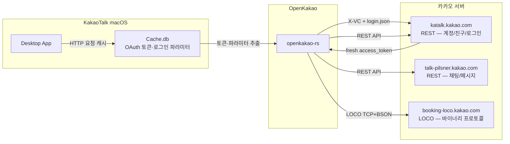

# OpenKakao

<p align="center">
  
</p>

[](https://github.com/JungHoonGhae/openkakao/stargazers)
[](https://github.com/JungHoonGhae/openkakao/blob/main/LICENSE)
[](https://www.rust-lang.org/)

**한국어** | [English](README.en.md)

카카오톡 macOS 데스크탑 앱의 비공식 CLI 클라이언트. 채팅방, 메시지, 친구 목록에 접근하고, LOCO 프로토콜로 메시지를 보내고 받을 수 있다.

> **Disclaimer**: 이 프로젝트는 기술 연구 목적의 CLI 도구입니다. 카카오(Kakao Corp.)와 무관하며, 카카오의 승인이나 보증을 받지 않았습니다.

## 배경

카카오톡에는 공식 개발자 API가 없다. Discord, Slack, Telegram과 달리, 메시지를 프로그래밍으로 읽거나 보내는 방법이 제공되지 않는다.

OpenKakao는 macOS 카카오톡 바이너리를 정적 분석하여 인증 알고리즘(X-VC)을 파악하고, 내부 바이너리 프로토콜(LOCO)을 Rust로 구현했다.

- 카카오톡 메시지 읽기/보내기
- 채팅방, 친구, 프로필 조회
- `jq`, `cron`, `LLM` 등 Unix 도구와 조합 가능

## Features

- 💬 **채팅방** — 전체 채팅방 목록, 안 읽은 메시지 필터링, 검색
- 📖 **메시지** — 채팅 메시지 읽기, 전체 조회(`--all`), 검색, 내보내기(JSON/CSV/TXT)
- 👥 **친구** — 전체 목록, 즐겨찾기, 이름 검색, 즐겨찾기 추가/제거, 숨김/해제
- 👤 **프로필** — 내 프로필, 친구 프로필, 멀티 프로필, 계정 설정
- 🔗 **링크 프리뷰** — URL 스크래핑 (OG 태그)
- 🔐 **자동 인증** — macOS 카카오톡 앱에서 토큰 자동 추출 + X-VC 기반 로그인
- 🔌 **LOCO 프로토콜** — 카카오톡 바이너리 프로토콜(TCP+BSON) 연결 (Booking → Checkin → Login)
- 📤 **JSON 출력** — 모든 커맨드에 `--json` 플래그 지원, `jq`와 조합 가능
- 🐚 **Shell completions** — bash/zsh/fish 자동완성

## Requirements

| Requirement | Version/Notes |
|-------------|---------------|
| macOS | 카카오톡 데스크탑 앱 설치 및 로그인 |
| Rust | >= 1.75 (소스 빌드 시) |

## Installation

```bash
# Homebrew
brew tap JungHoonGhae/openkakao
brew install openkakao-rs

# 또는 소스에서 빌드
git clone https://github.com/JungHoonGhae/openkakao.git
cd openkakao/openkakao-rs
cargo install --path .
```

## Agent Skill

OpenKakao 전용 에이전트 스킬은 `JungHoonGhae/skills`에 포함되어 있습니다.

```bash
npx skills add JungHoonGhae/skills@openkakao-cli
```

## Quick Start

```bash
# 1. 인증 (카카오톡 앱이 실행 중이어야 함)
openkakao-rs login --save

# 2. 채팅방 목록
openkakao-rs chats

# 3. 메시지 읽기
openkakao-rs read <chat_id>

# 4. LOCO 프로토콜 연결 테스트
openkakao-rs loco-test
```

## Usage

### 인증

```bash
# 토큰 추출 + 저장
openkakao-rs login --save

# 토큰 유효성 확인
openkakao-rs auth

# login.json으로 토큰 재발급 (X-VC 자동 생성)
openkakao-rs relogin --fresh-xvc

# 토큰 갱신 (refresh_token 사용)
openkakao-rs renew
```

### 채팅

```bash
# 채팅방 목록 (최근 30개)
openkakao-rs chats

# 전체 채팅방
openkakao-rs chats --all

# 안 읽은 채팅만
openkakao-rs unread

# 채팅방 검색
openkakao-rs chats --search "프로젝트"

# 타입별 필터 (dm, group, memo, open)
openkakao-rs chats --type dm

# 메시지 읽기 (최근 30개)
openkakao-rs read <chat_id>

# 최근 10개만
openkakao-rs read <chat_id> -n 10

# 전체 메시지 조회 (cursor 페이지네이션)
openkakao-rs read <chat_id> --all

# 채팅방 멤버
openkakao-rs members <chat_id>

# 메시지 검색
openkakao-rs search <chat_id> "키워드"

# 메시지 내보내기
openkakao-rs export <chat_id> --format json
openkakao-rs export <chat_id> --format csv -o messages.csv
openkakao-rs export <chat_id> --format txt
```

### 친구

```bash
# 전체 친구 목록
openkakao-rs friends

# 즐겨찾기만
openkakao-rs friends -f

# 이름으로 검색
openkakao-rs friends -s "홍길동"

# 친구 프로필 조회
openkakao-rs profile <user_id>

# 즐겨찾기 추가/제거
openkakao-rs favorite <user_id>
openkakao-rs unfavorite <user_id>

# 친구 숨김/해제
openkakao-rs hide <user_id>
openkakao-rs unhide <user_id>
```

### 프로필/설정

```bash
# 내 프로필
openkakao-rs me

# 멀티 프로필 목록
openkakao-rs profiles

# 계정 설정
openkakao-rs settings

# 알림 키워드
openkakao-rs keywords

# JSON 출력 (모든 커맨드에 사용 가능)
openkakao-rs me --json
openkakao-rs friends --json | jq '.[]'
```

### LOCO 프로토콜

```bash
# LOCO 연결 테스트 (booking → checkin → login)
openkakao-rs loco-test

# 메시지 전송
openkakao-rs send <chat_id> "메시지 내용"

# 실시간 메시지 수신
openkakao-rs watch
openkakao-rs watch --chat-id <chat_id>

# 채팅 히스토리 읽기 (SYNCMSG)
openkakao-rs loco-read <chat_id>
openkakao-rs loco-read <chat_id> --all

# 채팅방 목록 (LOCO)
openkakao-rs loco-chats
```

### 유틸리티

```bash
# 링크 프리뷰
openkakao-rs scrap https://github.com

# Shell completions
openkakao-rs completions zsh >> ~/.zfunc/_openkakao-rs
openkakao-rs completions fish > ~/.config/fish/completions/openkakao-rs.fish

# Cache.db 토큰 감시
openkakao-rs watch-cache --interval 10
```

## 작동 원리


```mermaid
flowchart LR
    subgraph 앱["KakaoTalk macOS"]
        A[Desktop App]
        C[Cache.db<br/>OAuth 토큰·로그인 파라미터]
    end
    subgraph 서버["카카오 서버"]
        K[katalk.kakao.com<br/>REST — 계정/친구/로그인]
        P[talk-pilsner.kakao.com<br/>REST — 채팅/메시지]
        L[booking-loco.kakao.com<br/>LOCO — 바이너리 프로토콜]
    end
    subgraph 도구["OpenKakao"]
        O[openkakao-rs]
    end

    A -->|HTTP 요청 캐시| C
    C -->|토큰·파라미터 추출| O
    O -->|X-VC + login.json| K
    K -->|fresh access_token| O
    O -->|REST API| K
    O -->|REST API| P
    O -->|LOCO TCP+BSON| L
```

### 인증 흐름

1. macOS 카카오톡 앱의 Cache.db에서 로그인 파라미터 추출
2. X-VC 헤더 생성 (바이너리 정적 분석으로 파악한 인증 알고리즘)
3. `login.json`으로 fresh access_token 발급
4. REST API 호출 또는 LOCO 프로토콜 연결

### LOCO 프로토콜

카카오톡의 바이너리 TCP 프로토콜. 22바이트 리틀엔디안 헤더 + BSON 바디.

| 단계 | 서버 | 방식 | 역할 |
|------|------|------|------|
| Booking | `booking-loco.kakao.com:443` | TLS | 서버 구성 정보 조회 |
| Checkin | `ticket-loco.kakao.com:995` | RSA+AES | 채팅 서버 할당 |
| Login | LOCO 서버 | RSA+AES | 인증 + 채팅방 수신 |

## 활용 예시

메시지 송수신이 가능하므로, 다양한 자동화를 구성할 수 있다.

| 카테고리 | 예시 |
|----------|------|
| **자동화** | `cron`으로 매일 아침 안 읽은 메시지 요약 전송, 특정 키워드 감지 시 알림 |
| **AI 연동** | LLM에 대화 컨텍스트를 넘겨서 자동 응답, 요약, 번역 |
| **데이터 파이프라인** | 채팅 메시지를 SQLite/PostgreSQL에 적재, 공유 링크 자동 아카이빙 |
| **모니터링** | 오픈채팅방 키워드 모니터링, 대화량 통계, 감성 분석 |
| **개인 도구** | 안 읽은 채팅 대시보드, 기간/유저별 검색, 대화 내보내기 |

```bash
# 안 읽은 채팅 요약을 매일 아침 나에게 전송
openkakao-rs unread --json | jq -r '.[] | "\(.title): \(.unread_count)건"' | \
  xargs -I{} openkakao-rs send <memo_chat_id> "{}"

# 특정 채팅방의 최근 메시지를 LLM으로 요약
openkakao-rs read <chat_id> --all --json | llm "이 대화를 3줄로 요약해줘"
```

> 비공식 API 기반이므로, 개인 연구/자동화 용도로만 사용하는 것을 권장합니다.

## 한계

- **macOS 전용** — 토큰 추출이 macOS의 NSURLCache에 의존
- **비공식** — 카카오 서버 업데이트에 의해 동작이 중단될 수 있음
- **REST 캐시 제한** — pilsner REST API는 최근 열었던 채팅방 메시지만 반환 (LOCO로 우회 가능)

## TODO

### ✅ 완료

| 항목 | 비고 |
|------|------|
| NSURLCache에서 OAuth 토큰 추출 | `login --save` |
| X-VC 인증 알고리즘 역공학 | `relogin --fresh-xvc` |
| katalk.kakao.com REST | 계정/친구/설정/프로필/즐겨찾기/숨김 |
| talk-pilsner.kakao.com REST | 채팅방 목록, 메시지 읽기/검색/내보내기, 멤버 |
| LOCO 프로토콜 (Booking → Checkin → Login) | `loco-test` — 27개 채팅방 수신 확인 |
| LOCO 메시지 전송 (WRITE) | `send <chat_id> "메시지"` — 실제 전송 검증 완료 |
| LOCO 실시간 수신 (watch) | `watch [--chat-id ID]` — 실시간 메시지 수신 |
| LOCO 메시지 읽기 (SYNCMSG) | `loco-read <chat_id> --all` — 서버 보관 히스토리 조회 |
| 토큰 자동 갱신 | `relogin --fresh-xvc` — login.json + X-VC로 fresh token 발급 |
| LOCO 패킷 코덱 + 암호화 | 22B 헤더 + BSON, RSA-2048 OAEP + AES-128-CFB |
| JSON 출력 | `--json` 글로벌 플래그 |
| Shell completions | bash/zsh/fish |
| 컬러 출력 | `--no-color` 플래그 |

### 📋 할 일

| 우선순위 | 항목 | 비고 |
|----------|------|------|
| 중간 | TUI 모드 | `ratatui` 기반 터미널 UI |
| 중간 | 미디어 첨부파일 파싱 | attachment JSON 파싱 + 다운로드 |
| 낮음 | Webhook/Hook 시스템 | 메시지 수신 시 쉘 스크립트/webhook |
| 낮음 | macOS 알림 연동 | `watch` 모드에서 네이티브 알림 |

## 면책 조항

> 이 소프트웨어는 기술 연구 목적으로 제작되었으며, "있는 그대로(AS IS)" 제공됩니다. 카카오톡 이용약관에 위배될 수 있으며, 사용으로 인한 모든 결과는 사용자 책임입니다. 반드시 본인 계정으로만 사용하십시오.

## 참조 프로젝트

| 프로젝트 | 참고 내용 |
|----------|-----------|
| [node-kakao](https://github.com/storycraft/node-kakao) | LOCO 프로토콜 구현 (패킷 구조, BSON 필드) |
| [KiwiTalk](https://github.com/KiwiTalk/KiwiTalk) | Rust LOCO/REST 아키텍처 |
| [kakao.py](https://github.com/jhleekr/kakao.py) | Python LOCO/HTTP 구현 |
| [kakaotalk_analysis](https://github.com/stulle123/kakaotalk_analysis) | 보안/프로토콜 분석 |

## Contributing

기여를 환영합니다! [CONTRIBUTING.md](CONTRIBUTING.md)를 참고해주세요.

## Changelog

변경 이력은 [CHANGELOG.md](CHANGELOG.md)를 참고해주세요.

## License

MIT — [LICENSE](LICENSE) 참조.
