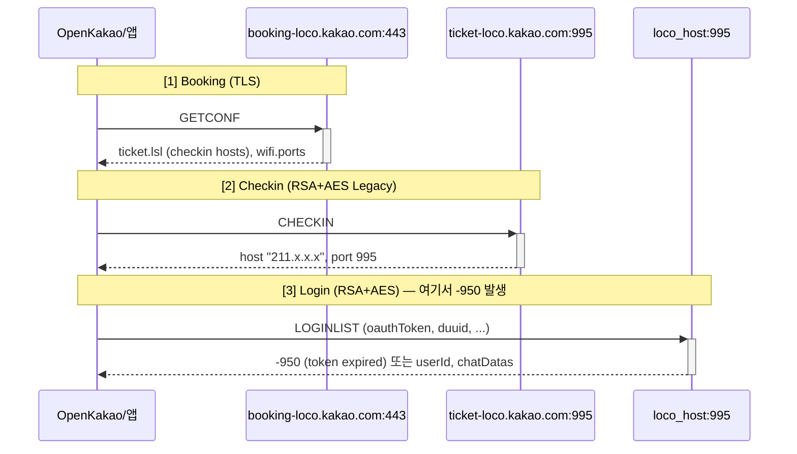

# KakaoTalk Protocol Technical Reference

이 문서는 OpenKakao가 참고하는 KakaoTalk macOS 앱 리버스 엔지니어링에서 얻은 기술적 세부사항을 정리한 것이다.

## 해결된 항목 요약

| 항목 | 상태 | 비고 |
|------|------|------|
| NSURLCache에서 OAuth 토큰 추출 | **해결** | `openkakao.auth`: request_object plist에서 Authorization 헤더 추출 |
| katalk.kakao.com REST (계정/친구/설정) | **해결** | more_settings.json, friends/update.json — `openkakao me/friends/settings` |
| talk-pilsner.kakao.com REST (채팅/메시지) | **해결** | 채팅방 목록, 메시지 읽기, 멤버, 링크 프리뷰 — `openkakao chats/read/members/scrap` |
| LOCO Booking (GETCONF) | **해결** | TLS → booking-loco.kakao.com:443 |
| LOCO Checkin (CHECKIN) | **해결** | RSA+AES 핸드셰이크, key_encrypt_type=16 |
| LOCO 패킷 코덱 (22B 헤더 + BSON) | **해결** | `openkakao.packet`, `openkakao.crypto` |
| LOCO LOGINLIST | **차단** | 동일 토큰으로 -950 (토큰 만료) 반환 |
| 메시지 전송 (WRITE) | **차단** | LOCO 로그인 필요 |
| renew_token.json 파라미터 | 미해결 | POST body 미캐시, mitmproxy 캡처 필요 |
| UserDefaults 복호화 | 미해결 | 런타임 키 파생 |
| __hhaa__ 응답 body 복호화 | 미해결 | 캐시 응답 읽기 불필요로 우선순위 낮음 |
| login.json X-VC 헤더 | 미해결 | 생성 알고리즘 미상 |

---

## 1. 바이너리 분석

### 바이너리 위치
```
/Applications/KakaoTalk.app/Contents/MacOS/KakaoTalk
```

### 유용한 명령어
```bash
strings -t x binary | grep "keyword"           # 문자열 + 오프셋
otool -oV binary | grep "methodName"           # ObjC 메서드 주소
objdump -d --start-address=0xADDR binary       # 디스어셈블
nm binary | grep "symbol"                       # 심볼 테이블
```

### 핵심 발견: HANDSHAKE_KEY_ENCRYPT_TYPE
- `LocoV2SLCrypto.handshakeData` 메서드를 otool로 디스어셈블하여 발견
- 값이 `$0x10` (=16)이어야 함. 15로 설정하면 서버가 즉시 연결 종료
- 이 1비트 차이가 전체 CHECKIN 성공/실패를 결정

### RSA 키 파라미터
- 2048-bit (초기 추측 1024-bit에서 수정)
- e=3
- SHA-1 (SHA-256이 아님 — Apple의 kSecPaddingOAEPKey 기본값)
- 키는 바이너리에서 DER 인코딩된 Base64로 추출

### Objective-C 메타데이터
Swift/ObjC 바이너리에서 메서드 이름은 메타데이터 섹션에 평문으로 존재:
- `renewTokenOnSuccess:failure:` — 토큰 갱신 메서드
- `LocoV2SLCrypto.handshakeData` — 핸드셰이크 생성
- `BCLocoClient` — LOCO 클라이언트 클래스
- `LocoAgent` — 저수준 패킷 송수신
- `LocoPacketProducer` — 패킷 생성

## 2. 토큰 체계

### OAuth 토큰 구조 (138 chars)
```
b6aa3ad5aa824fbeab69186349fe8172  ← 32자 hex UUID (세션 식별자, 변경됨)
00000017720851402                 ← 타임스탬프 (epoch)
910020u2uTN50blF                 ← 알파+숫자 (서버 생성 코드)
-                                ← 구분자
TBCsguFg/afhcB/BNyhfH7oFM67T... ← Base64 device UUID (고정)
```

- 캐시에서 7개의 다른 UUID 부분 발견 → 토큰이 자주 갱신됨
- device UUID 부분은 모든 토큰에서 동일 → 디바이스 바인딩

### 핵심: REST API vs LOCO — 별개의 인증 체계
같은 토큰이 REST API에서는 유효하지만 LOCO에서는 -950(만료)를 반환한다.
이는 LOCO 서버가 다른 토큰 검증 로직을 사용하거나 LOCO 전용 세션 토큰이 별도로 존재함을 의미.

### UserDefaults 암호화 (미해결)
- 난독화된 키: `C93zxc fdEW089Z SDFA` (OAuth 토큰), `Dfpr93S FDS zXCV` (device UUID)
- 바이너리에서 찾은 후보 키들: `HGAJMRSCJJAJEJDI`, `NcLqZEglX5R71a7o`, `MtQcL0x822tb`
- ECB/CBC/CFB 모든 모드로 시도했으나 복호화 실패
- `%@%@%@` 포맷 스트링 발견 → 키가 런타임에 합성될 가능성 높음
- **해결 방법**: Frida로 런타임 후킹 필요

### renew_token.json (미해결)
```
POST katalk.kakao.com/mac/account/renew_token.json
Content-Length: 111
```
- `grant_type`과 `refresh_token` 파라미터 이름이 바이너리에 존재
- 24바이트(grant_type=refresh_token) + 87바이트 미지 파라미터
- 모든 시도에서 -400 (필수 파라미터 누락)
- **해결 방법**: mitmproxy로 실제 POST body 캡처 필요

## 3. LOCO 프로토콜 상세

### 전체 연결 흐름



| 단계 | 전송 | 서버 | 명령 |
|------|------|------|------|
| 1. Booking | TLS | booking-loco.kakao.com:443 | GETCONF → checkin 호스트/포트 획득 |
| 2. Checkin | RSA+AES | ticket-loco.kakao.com:995 | CHECKIN → LOCO 서버 IP 획득 |
| 3. Login | RSA+AES | \<loco_host\>:995 | LOGINLIST → 채팅 목록 또는 -950 |

### 서버 주소
| 역할 | 호스트 | 포트 |
|------|--------|------|
| Booking (V2SL/TLS) | booking-loco.kakao.com | 443 |
| Checkin (Legacy) | ticket-loco.kakao.com | 995 |
| LOCO Chat (Legacy) | 211.183.215.x 등 (동적) | 995 |
| REST API | katalk.kakao.com | 443 |
| REST (Pilsner) | talk-pilsner.kakao.com | 443 |

**Pilsner REST (해결됨)**  
OpenKakao는 동일 OAuth 토큰으로 `talk-pilsner.kakao.com`에 JSON GET 요청을 보내 채팅방 목록, 메시지 목록, 채팅방 멤버, 링크 프리뷰를 조회한다. (`openkakao chats`, `openkakao read`, `openkakao members`, `openkakao scrap`) 메시지 전송은 LOCO WRITE가 필요하므로 현재 차단 상태이다.

### LOCO 명령어 (확인된 것)

| 명령어 | 방향 | 용도 |
|--------|------|------|
| GETCONF | → | 서버 설정 조회 (booking) |
| CHECKIN | → | 체크인 (LOCO 서버 할당) |
| LOGINLIST | → | 로그인 + 채팅방 목록 |
| LCHATLIST | → | 채팅방 목록 조회 |
| GETMSGS | → | 메시지 조회 |
| WRITE | → | 메시지 전송 |
| GETMEM | → | 채팅방 멤버 조회 |
| CHATINFO | → | 채팅방 정보 |
| NOTIREAD | → | 읽음 처리 |
| PING | → | 연결 유지 |
| MSG | ← | 실시간 메시지 수신 (push) |

### LOGINLIST 요청 필드

```python
{
    "appVer": "3.7.0",     # 앱 버전
    "os": "mac",
    "lang": "ko",
    "duuid": "...",         # device UUID (토큰의 대시 뒤 부분)
    "oauthToken": "...",    # OAuth 토큰 (여기서 -950 발생)
    "ntype": 0,
    "MCCMNC": "99999",
    "revision": 0,
    "dtype": 2,             # 2 = PC
    "bg": False,
    "chatIds": [],
    "maxIds": [],
    "lastTokenId": 0,
    "lbk": 0,
}
```

## 4. macOS 앱 데이터 접근

### NSURLCache (Cache.db) — **토큰 추출 구현됨**
```
~/Library/Containers/com.kakao.KakaoTalkMac/Data/Library/Caches/Cache.db
```
- 테이블: `cfurl_cache_response` (메타데이터), `cfurl_cache_blob_data` (헤더/body)
- `request_object`: plist → `Array` 키 안에 dict로 HTTP 헤더 (Authorization 포함) — **OpenKakao에서 이 경로로 토큰 추출 구현·동작 중**
- `response_object`: plist → 응답 헤더
- POST body: **저장 안 됨**
- 응답 body: 앱이 `__hhaa__` 기반으로 자체 암호화하여 저장
- WAL 파일을 함께 복사해야 최신 데이터 확보

### `__hhaa__` 헤더
- 요청의 `__hhaa__` 헤더: base64 인코딩된 plist (실제 HTTP 헤더의 복사본)
- 응답의 `__hhaa__` 헤더: 비슷한 구조
- 응답 body 암호화: NSURLSession 레벨에서 앱이 자체 암복호화
- 복호화 방법 미해결

### UserDefaults
```bash
defaults read com.kakao.KakaoTalkMac
```
- 토큰/UUID 값이 AES로 암호화되어 저장
- 런타임 키 파생 사용 (정적 분석으로 복호화 실패)

### 접근 불가 경로
- lldb attach → 코드 서명 차단
- DYLD_INSERT_LIBRARIES → SIP 차단
- 채팅 DB → SQLCipher 암호화

## 5. 디버깅 팁

### 네트워크 연결 확인
```bash
lsof -i -n -P -a -p $(pgrep -x KakaoTalk)
```

### 프로세스 확인
```bash
pgrep -x KakaoTalk
```

### 캐시 DB 실시간 모니터링
```bash
# Python으로 tmp에 복사 후 sqlite3로 읽기
# WAL 파일 필수 포함 (최신 데이터)
```

### mitmproxy 설정 (아직 미실행)
```bash
mitmdump -s scripts/mitm_kakao.py --set stream_large_bodies=0
# 캡처 결과: /tmp/kakao_captured_tokens.json
```

## 6. 미해결 / 차단 요약

앞선 **해결된 항목 요약** 표와 대응한다. 아래는 아직 미해결이거나 LOCO -950으로 차단된 항목이다.

| 문제 | 상태 | 해결 후보 |
|------|------|-----------|
| LOCO -950 토큰 만료 (LOGINLIST) | **차단** | mitmproxy로 renew_token 캡처 / Frida로 앱이 사용하는 토큰 확인 |
| renew_token.json 파라미터 | 미해결 | mitmproxy POST body 캡처 |
| UserDefaults 복호화 | 미해결 | Frida 런타임 후킹 |
| login.json X-VC 헤더 | 미해결 | 바이너리 분석 / Frida |
| __hhaa__ 응답 복호화 | 미해결 (우선순위 낮음) | 바이너리 분석 — 채팅/메시지는 Pilsner REST로 대체 가능 |
| 메시지 전송 (LOCO WRITE) | **차단** | LOCO 로그인(-950) 해결 후 가능 |
