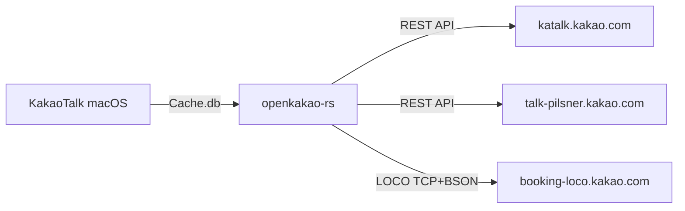

# OpenKakao

OpenKakao is an unofficial KakaoTalk CLI client built by reverse engineering the macOS desktop app. It provides programmatic access to personal chats — something KakaoTalk's official APIs don't offer.

<CardGroup cols={2}>
  <Card title="Quick Start" icon="rocket" href="/quickstart">
    Get up and running in 2 minutes
  </Card>
  <Card title="CLI Reference" icon="terminal" href="/cli/overview">
    Full command reference
  </Card>
  <Card title="LOCO Protocol" icon="lock" href="/protocol/overview">
    How the binary protocol works
  </Card>
  <Card title="Automation" icon="robot" href="/guides/automation">
    Build automations with Unix tools
  </Card>
</CardGroup>

## What Can It Do?

| Feature | Description |
|---------|-------------|
| **Chat rooms** | List all chats, filter by unread/type, search |
| **Messages** | Read full history, search, export (JSON/CSV/TXT) |
| **Send** | Text, photos, videos, and files via LOCO |
| **Real-time** | Watch incoming messages with auto-reconnect |
| **Media** | Download/upload attachments, auto-download in watch mode |
| **Friends** | List, search, favorite, hide/unhide |
| **Profile** | View your profile, friends' profiles, account settings |
| **JSON output** | Pipe to `jq`, `llm`, or any Unix tool |

## How It Works

OpenKakao extracts authentication credentials from the macOS KakaoTalk app, then communicates with Kakao's servers using two protocols:

1. **REST API** — `katalk.kakao.com` and `talk-pilsner.kakao.com` for account, friends, and cached messages
2. **LOCO Protocol** — KakaoTalk's custom binary TCP protocol (22-byte header + BSON) for real-time messaging

## Requirements

- **macOS** with KakaoTalk desktop app installed and logged in
- **Rust >= 1.75** (if building from source)

<Warning>
  This is an unofficial tool for technical research purposes. It is not endorsed by Kakao Corp. Use only with your own account.
</Warning>
