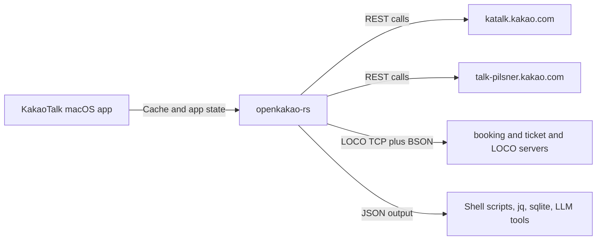

# OpenKakao

OpenKakao는 개발자, 터미널 친화적 사용자, 자동화 중심 워크플로를 위한 비공식 KakaoTalk macOS CLI입니다. 채팅, 메시지 히스토리, watch 이벤트, 통제된 아웃바운드 작업 주변에 실질적인 워크플로 표면을 엽니다.

> [!NOTE]
> 이 프로젝트가 실제로 유용한지 먼저 판단하려면 [활용 사례](/ko/docs/automation/overview)부터 보세요. 리스크 경계가 필요해지는 시점에는 [신뢰 모델](/ko/docs/security/trust-model)로 넘어가면 됩니다.

## 여기서 시작하세요

| | |
|---|---|
| [**활용 사례**](/ko/docs/automation/overview) - OpenKakao가 실제 워크플로에서 어디서 유용한지 | [**빠른 시작**](/ko/docs/getting-started/quickstart) - 설치, 인증, 짧은 채팅 읽기까지 가장 빠른 경로 |
| [**보안**](/ko/docs/security/trust-model) - CLI가 무엇을 만지고 저장하며 어디서 위험해지는지 | [**CLI 레퍼런스**](/ko/docs/cli/overview) - 명령별 참조 문서 |
| [**REST vs LOCO**](/ko/docs/getting-started/transport-boundary) - 어떤 작업에 어떤 전송 계층이 맞는지 | [**프로토콜 노트**](/ko/docs/protocol/overview) - LOCO와 전송 동작에 대한 더 깊은 기술 문서 |

## 어디서 도움이 되는가

OpenKakao는 보통 아래 결과가 필요할 때 가장 강합니다.

- unread 채팅을 요약, 대시보드, 검토 큐로 바꿀 때
- 메시지 히스토리를 JSON, SQLite, 로컬 검색 도구로 export 할 때
- watch 이벤트에서 로컬 스크립트나 webhook을 트리거할 때
- KakaoTalk를 운영자 도구, LLM, agent의 입력 채널로 쓸 때
- 신중한 아웃바운드 작업을 통제된 로컬 워크플로에 넣고 싶을 때

## 왜 존재하는가

많은 사람에게 KakaoTalk는 이미 요청, 업데이트, 조율이 모이는 곳입니다. 하지만 개인 개발자 워크플로 표면은 구조적으로 제한돼 있습니다. 히스토리를 읽고, 이벤트에 반응하고, 메시지 문맥을 로컬 도구로 옮기려면 보통 수작업이나 깨지기 쉬운 우회가 필요합니다.

OpenKakao는 그 표면을 로컬에서 열기 위해 존재합니다.

## 동작 모델

전송 계층은 이렇게 이해하면 됩니다.

- REST는 빠른 계정 점검과 캐시 기반 읽기
- LOCO는 실제 채팅 워크플로, watch 모드, 미디어, 전송

## 신뢰 경계

OpenKakao는 실제 앱과 가깝기 때문에 유용하고, 같은 이유로 민감합니다.

문서는 다음을 분명히 적습니다.

- CLI가 로컬 머신에서 무엇을 읽는지
- 어떤 자격 증명을 로컬에 저장하는지
- 어떤 네트워크 엔드포인트와 통신하는지
- 어떤 자동화가 좁고 검토 가능하게 유지돼야 하는지

## 다음 경로

- 처음이라면: [왜 OpenKakao인가](/ko/docs/overview/why-openkakao)
- 바로 써보고 싶다면: [설치](/ko/docs/getting-started/installation)
- 신뢰 경계를 먼저 보고 싶다면: [데이터와 자격 증명](/ko/docs/security/data-and-credentials)
- 실전 패턴이 궁금하다면: [공통 레시피](/ko/docs/automation/common-recipes)
