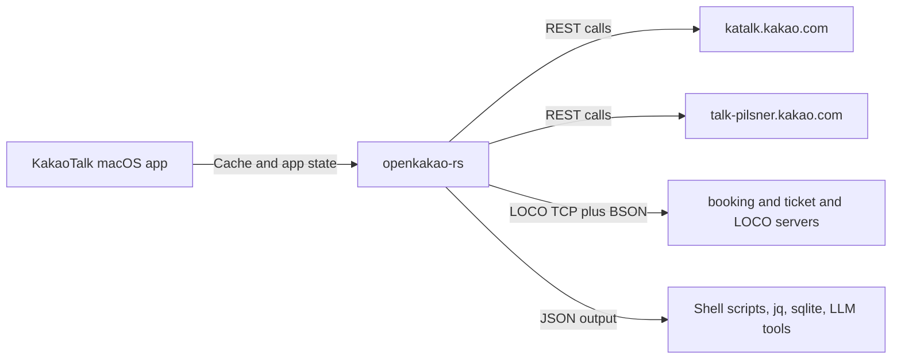

# OpenKakao

OpenKakao is an unofficial KakaoTalk CLI for macOS aimed at developers, terminal-native users, and automation-heavy workflows. It opens a practical workflow surface around chats, message history, watch events, and controlled outbound actions.

> [!NOTE]
> Start with [Use Cases](/docs/automation/overview) if you are deciding whether the project is useful. Move to [Trust Model](/docs/security/trust-model) once you need the risk boundary.

## Start Here

| | |
|---|---|
| [**Use Cases**](/docs/automation/overview) - Where OpenKakao becomes useful in real workflows | [**Quickstart**](/docs/getting-started/quickstart) - Install, authenticate, and read a chat in a few minutes |
| [**Security**](/docs/security/trust-model) - What the CLI touches, stores, and where the risks are | [**CLI Reference**](/docs/cli/overview) - Command-by-command reference |
| [**REST vs LOCO**](/docs/getting-started/transport-boundary) - Decide which transport fits which task | [**Protocol Notes**](/docs/protocol/overview) - Deeper technical notes on LOCO and transport behavior |

## Where It Helps

OpenKakao is strongest when you need one of these outcomes:

- turn unread chats into summaries, dashboards, or review queues
- export message history into JSON, SQLite, or local search tools
- trigger local scripts or webhooks from watch events
- use KakaoTalk as an input channel for operator tools, LLMs, or agents
- move careful outbound actions into a controlled local workflow

## Why It Exists

KakaoTalk is already where requests, updates, and coordination happen for many people. But personal developer workflow surface is still structurally limited. Reading history, reacting to events, or moving message context into local tools usually means manual work, brittle workarounds, or nothing at all.

OpenKakao exists to open that surface locally.

## Working Model

Use the transport boundary as a rule of thumb:

- REST for fast account checks and cache-backed reads
- LOCO for real chat workflows, watch mode, media, and sending

## Trust Boundary

OpenKakao is useful because it stays close to the real app. It is sensitive for the same reason.

The docs are explicit about:

- what the CLI reads from your machine
- what credentials it stores locally
- what network endpoints it talks to
- which automations should stay narrow and reviewable

## Next Paths

- New here: [Why OpenKakao](/docs/overview/why-openkakao)
- Ready to try it: [Installation](/docs/getting-started/installation)
- Need the trust boundary first: [Data & Credentials](/docs/security/data-and-credentials)
- Want practical patterns: [Common Recipes](/docs/automation/common-recipes)
